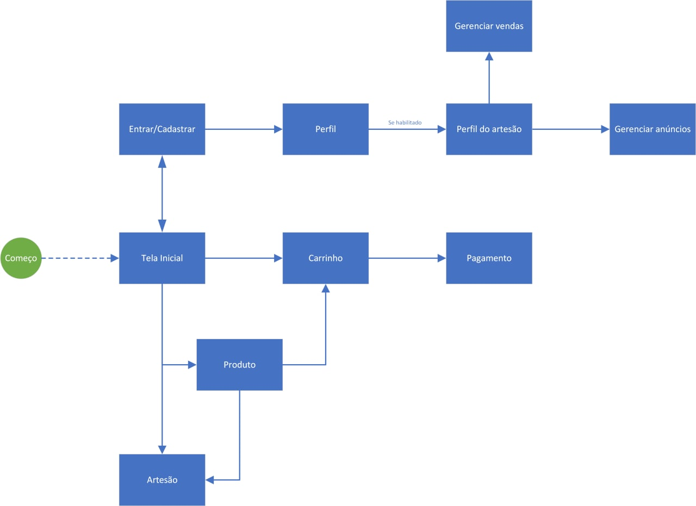
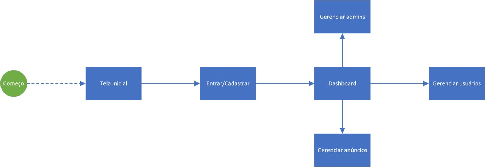

# artezaria

> Projeto de uma loja de compra e venda de artes em geral. Requisito parcial da disciplina de Introdução ao Desenvolvimento Web (SCC0219) do curso de Ciências de Computação do ICMC/USP durante o 1º semestre de 2022.

## 1. Requerimentos

* O sistema deve ter dois tipos gerais de usuários: **clientes** e **administradores**; **clientes** devem poder ativar a funcionalidade de **artesão** e se tornarem **clientes artesãos**:
  
  * Administradores são responsáveis por registrar e gerenciar administradores, clientes, e produtos ou serviços disponivilizados.
  
  * Clientes são usuários que acessam o sistema para comprar produtos.

  * Clientes artesãos são clientes que, tendo ativada a funcionalidade de artesão, acessam o sistema para anunciar produtos.

* O registro de administrador deve incluir, no mínimo, `nome`, `id`,  e `email`.

* Cada registro de cliente deve incluir, no mínimo, `nome`, `id`,  `address` e `email`.

* Quando um cliente ativar a opção de artesão, seu registro também deve incluir `description`.

* O registro de produtos deve incluir, no mínimo, `id`, `title`, `image`, `description`, `price`, `quantity_in_stock` e `quantity_sold`.

* A loja deve vender apenas produtos.

* Processo de venda de um produto: produtos são selecionados, incluídos no carrinho e têm suas quantidades escolhidas. Produtos são comprados usando um número de cartão de crédito (sem validação). A quantidade de produtos vendidos é subtraída da quantidade em estoque e adicionada à quantidade vendida. Os carrinhos são esvaziados apenas após o pagamento ou, então, pelos clientes.

* Manutenção de produtos
  
  * Administradores podem ler e deletar produtos.

  * Clientes artesãos podem criar, atualizar, ler e deletar seus próprios produtos.

* O sistema deve ter uma funcionalidade extra de valorização aos clientes artesãos da plataforma. Todos eles devem ter páginas dedicadas contando com descrição.

* O sistema deve prover recursos de acessibilidade e boa usabilidade.

## 2. Descrição do projeto

**artezaria** é uma plataforma de compra e venda de obras de arte, como quadros, artesanatos, esculturas, sendo eles de produção única ou em larga quantidade. O foco principal é no comércio dos produtos, mas, também, de valorização de artistas, suas artes e histórias.

### 2.1. Protótipo

O protótipo da plataforma foi implementado usando HTML, CSS, alguns componentes do [Material Design](https://material.io/design) e o carrossel do framework [Owl Carousel 2](https://owlcarousel2.github.io/OwlCarousel2/) para a exibição dos produtos e os scripts necessários para o funcionamento dos elementos.

### 2.2. Versão em produção

A versão atual da plataforma, em produção, foi implementada usando o *framework*  React, ideais de estilização do [Material Design](https://material.io/design) e a biblioteca [Material UI](https://mui.com/), que implementa os componentes do Material Design. O protótipo se encontra na pasta `prototipo` e a versão em produção em `site`.

### 2.3. Diagramas de navegação

Para organizar os conjuntos de telas, foram desenvolvidos diagramas de navegação para o cliente e administrador.

#### a. Diagrama do Cliente

#### b. Diagrama do administrador

Os mockups desenvolvidos para as páginas do cliente estão sob a pasta `imagens/telas`, na raiz do projeto, com nomes correspondentes aos itens dos diagramas de tela.

### 2.4. Funcionalidades propostas para o sistema

Através das telas propostas, os autores esperam que, através do sistema:

1. Um usuário qualquer possa entrar com e-mail e senha na plataforma, cadastrar-se e alterar informações sobre seu próprio cadastro, através das telas `Entrar/Cadastrar` e `Perfil`;

2. Um cliente possa visualizar, adicionar ao carrinho e comprar Produtos disponíveis no site, através das telas `Tela Inicial`, `Produto`, `Carrinho` e `Pagamento`;

3. Um cliente possa visualizar a página de descrição de artistas ativos na plataforma através da tela `Artesão`;

4. Um cliente possa se tornar um cliente artesão, gerenciar suas informações de artesão, seus anúncios ativos e vendas em processo, através das telas `Perfil do artesão`, `Gerenciar vendas` e `Gerenciar anúncios`;

5. Um administrador possa gerenciar o sistema, administradores, anúncios e usuários através das telas `Dashboard`, `Gerenciar anúncios` e `Gerenciar usuários`.

## 3. Comentários sobre o código

### 3.1. Protótipo

O código-fonte do protótipo está disposto sob a pasta `prototipo`. Nela, estão as pastas `css`, com os estilos desenvolvidos, `pages`, com as páginas desenvolvidas e os demais arquivos utilizados pelas ferramentas externas utilizadas.

### 3.2. Versão em produção

O código-fonte do protótipo está disposto sob a pasta `site`. Nela, está a pasta `src`, diretório principal, com o conteúdo desenvolvido. O diretório é dividido em:

* `data`: dados *fake* de produtos, produtos comprados e de usuários;
* `domain`: definição dos objetos utilizados (`CreditCard`, `Product`, `PurchaseItem` e `User`);
* `presentation`:
	- `components`: componentes parciais utilizados nas telas;
	- `context`: contexto de aplicação de carrinho, gerenciamento, tema e usuário;
	- `pages`: páginas desenvolvidas;
	- `routers`: rotas para aplicação.
* Arquivos da aplicação.

## 4. Procedimentos de execução

### 4.1. Para o protótipo

Atualmente, basta realizar o download do repositório, navegar até a pasta em que estão dispostos os protótipos desenvolvidos e abrir num navegador web.

### 4.2. Para a versão em produção

No Ubuntu, instale o `npm` e, para construir projetos em React, use `npm install create-react-app`. Para executar o projeto, dentro da pasta `site`, execute `npm start`.

## 5. Plano de testes

### 5.1. Para o protótipo

O projeto foi executado apenas no navegador Google Chrome, sem problemas aparentes de execução. Quando houver a possibilidade de uso de frameworks e servidor, serão utilizadas as ferramentas adequadas para testes, como, por exemplo, JUnit e Postman.

### 5.2. Para a versão em produção

Os itens marcados com ¹ representam interfaces funcionais (telas e botões), mas sem efeitos.

#### a. Cliente

* Faça *login* com o usuário padrão de cliente, e-mail `cliente@site.com` e senha `cliente123`;
* A tela inicial deve ser exibida com os produtos. Acesse uma página de produto com `ver mais` de um dos produtos; alternativamente, ao clicar no nome do artista da obra, deve ocorrer um redirecionamento para a página do artista.
* Clique em `terminar minha compra` ou clique no ícone de carrinho para ser redirecionado à página de carrinho; nela, alterer a quantidade e veja os campos se alterarem junots; alternativamente, exclua o item.
* Clique em `ir ao pagamento` para iniciar o checkout; insira seus dados, clique em `próximo`, veja a confirmação da compra e clique em `finalizar`.
* Ao finalizar, uma mensagem de confirmação é exibida, o carrinho resetado e retorna-se à página inicial.

#### b. Artesão

* Faça *login* com o usuário padrão de artesão, e-mail `artesao@site.com` e senha `artesao123`;
* Clique no ícone de perfil para acessar as opções de usuário;
* Clique em `anúncios` para ver seus anúncios;
* Clique em `criar novo anúncio` para ser redirecionado à tela de anúncio¹;
* Alternativamente, clique em `ver anúncio` para ir à página do anúncio (sem o botão de adicionar ao carrinho)¹;
* Alternativamente, clique em `ver vendas` para ver as vendas realizadas e seus status¹.

#### c. Administrador

* Faça *login* com o usuário padrão de administrador, e-mail `admin@site.com` e senha `admin123`;
* A tela inicial deve mostrar apenas as opções de gerenciamento; o cabeçalho deve mostrar apenas o ícone de gerenciamento;
* Clique em `gerenciar anúncios` para acessar a tela de gerenciamento de anúncios¹;
* Alternativamente, clique em `gerenciar usuários` para acessar a tela de gerenciamento de usuários
	- Se o usuário for do tipo `cliente`, não deve haver a opção de `ver perfil`;
	- Se o usuário for do tipo `administrador`, não deve haver a opção de `excluir`.

## 6. Problemas

* **Construção dos protótipos iniciais**: a intenção do grupo era utilizar os componentes (campos de texto, botões e cards) disponibilizados pelo Material Design. Isso não foi plenamente possível pois, para a implementação, seriam necessários arquivos de configuração personalizados externos aos `.html` e `.css` criados.

## Autores

* [Gustavo Henrique Brunelli (11801053)](https://github.com/gbrunelli)

* [Matheus Henrique de Cerqueira Pinto (11911104)](https://github.com/cerqueiramatheus)

* [Matheus Ventura de Sousa (11345541)](https://github.com/matheus-sousa007)
